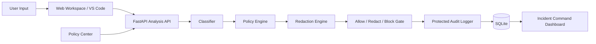

# SentinelGuard

## AI Preflight Policy Layer for Enterprise Data Protection

SentinelGuard protects enterprise users from leaking sensitive data into generative AI workflows. It scans prompts and code before they leave trusted tools, detects secrets and regulated data, applies a configurable policy, produces sanitized content when possible, blocks high-risk submissions, and records protected audit evidence for security review.

Structure Of The MVP Of SentinelGuard:

- FastAPI backend for classification, policy evaluation, redaction, enforcement decisions, and protected incident logging.
- React web app with an AI Workspace, Incident Command dashboard, and Policy Center.
- VS Code extension that brings the same guardrails directly into developer workflows.
- Docker Compose setup for a one-command demo environment.

---

## Why This Matters

Employees increasingly use AI assistants to summarize tickets, debug code, draft emails, analyze logs, and work with customer data. The risk is simple: they may paste API keys, database URIs, payment details, health identifiers, legal content, HR data, or internal business information into external AI systems.

SentinelGuard solves the preflight problem:

> Before content reaches an AI tool, SentinelGuard decides whether it should be allowed, redacted, or blocked.

The product is built around five enterprise needs:

1. Prevent accidental leakage of secrets and private data.
2. Give users a safe sanitized version when useful.
3. Refuse high-risk content before external AI use.
4. Give security teams incident visibility and audit proof.
5. Let admins tune policy without editing code.

---

## Summary

| Criteria | How SentinelGuard Addresses It |
| --- | --- |
| Innovation and Creativity | AI-specific DLP workflow with web, IDE, policy, redaction, audit, and enforcement in one prototype. |
| Problem Relevance | Directly targets a real corporate risk: sensitive data pasted into AI tools. |
| Technical Implementation | Modular FastAPI pipeline, deterministic classifiers, policy engine, redaction engine, hash-chain audit logger, React UI, and VS Code extension. |
| Functionality of Prototype | End-to-end working flow: scan, classify, redact/block, gate AI send, log incidents, review dashboard, tune policy, scan from VS Code. |
| Scalability and Impact | Architecture can grow into SSO, RBAC, SIEM export, PostgreSQL, encrypted storage, and transparent AI gateway enforcement. |

---

## Core Capabilities

### 1. Sensitive Data Detection

SentinelGuard detects many categories of sensitive data:

- API keys, access tokens, bearer tokens, JWTs, passwords, and private keys.
- AWS, Azure, Google, GitHub, GitLab, Slack, Stripe, Twilio, SendGrid, npm, Vault, Datadog, PagerDuty, Heroku, and other vendor credential formats.
- Database and cache connection strings such as Postgres, MySQL, MongoDB, Redis, JDBC, Oracle, and SQL Server.
- Email addresses, phone numbers, SSNs, passports, driver's licenses, DOBs, and addresses.
- Aadhaar, PAN, EIN, VAT, GSTIN, IBAN, SWIFT/BIC, bank account numbers, routing numbers, and payment cards.
- Medical record, patient, insurance member, prescription, legal case, HR, payroll, compensation, order, invoice, shipment, and customer identifiers.
- Confidential business markers such as pricing, revenue, forecasts, contracts, proposals, roadmaps, and proprietary strategy.
- High-entropy unknown tokens that may represent secrets.

### 2. Configurable Policy Decisions

The backend returns one of three decisions:

- `ALLOW`: content is safe to send.
- `REDACT`: content can proceed only as sanitized text.
- `BLOCK`: content is refused before external AI use.

The Policy Center lets admins tune:

- Whether credentials and database URIs are blocked.
- Whether high-entropy tokens are redacted.
- Whether PII, financial data, government IDs, health data, legal markers, HR data, commerce data, and confidential business content are redacted.
- Whether incidents store protected sanitized previews or full original text.

### 3. AI Gateway Enforcement

The AI Workspace now includes a simulated AI gateway:

- A live policy indicator shows the active credential, PII, financial, and audit-storage settings.
- Allowed prompts can be sent.
- Redacted prompts can be sent only as sanitized content.
- Blocked prompts cannot be sent.

This makes SentinelGuard more than a scanner. It demonstrates a policy gate that controls what reaches an AI service.

### 4. Protected Incident Logging

SentinelGuard records every analysis request as an incident. The audit log includes:

- Source: `AI_WORKSPACE` or `IDE_GUARD`.
- User identifier.
- Protected original preview.
- Sanitized output.
- Risk level.
- Detected issue types.
- Decision.
- Policy snapshot active at the time of the decision.
- Timestamp.
- Hash-chain proof.

By default, sensitive incidents use `PROTECTED` audit storage. This means raw original sensitive prompts are replaced with sanitized previews in the incident record. `FULL_TEXT` mode exists for controlled demos only.

### 5. IDE-Native Developer Protection

The VS Code extension supports:

- Scan selected text.
- Scan current file.
- Backend health status.
- Diagnostics on risky scanned ranges.
- Rich scan reports.
- Copy sanitized output.
- Insert policy-safe prompt variants.
- Replace selected content with sanitized output.
- Open the matching dashboard incident.

---

## Architecture



Detailed architecture is documented in [docs/ARCHITECTURE.md](docs/ARCHITECTURE.md).

---

## Repository Structure

```text
SentinelGuard/
|-- backend/
|   |-- app/
|   |   |-- main.py
|   |   |-- classifiers/
|   |   |   `-- rules.py
|   |   |-- services/
|   |   |   |-- policy_engine.py
|   |   |   `-- logging_service.py
|   |   |-- models.py
|   |   |-- schemas.py
|   |   |-- database.py
|   |   `-- deps.py
|   |-- tests/
|   |   `-- test_rules.py
|   |-- Dockerfile
|   `-- requirements.txt
|-- frontend/
|   `-- sentinelguard-ui/
|       |-- src/
|       |   |-- pages/
|       |   |   |-- Workspace.tsx
|       |   |   |-- Dashboard.tsx
|       |   |   `-- Policy.tsx
|       |   |-- api/
|       |   |-- components/
|       |   `-- App.tsx
|       |-- Dockerfile
|       `-- package.json
|-- ide-guard/
|   `-- vscode-extension/
|       |-- src/
|       |   `-- extension.ts
|       |-- README.md
|       `-- package.json
|-- docs/
|   `-- ARCHITECTURE.md
|-- docker-compose.yml
|-- .env.example
`-- README.md
```

---

## Quick Start With Docker

Prerequisites:

- Docker Desktop

Run the full web demo:

```bash
docker compose up --build
```

Open:

- Frontend: `http://localhost:5173`
- Backend health: `http://localhost:8000/health`

Stop the stack:

```bash
docker compose down
```

The backend stores the prototype SQLite database in the `sentinelguard-data` Docker volume.

---

## Local Development Setup

### Backend

Prerequisites:

- Python 3.10 or later

Install and run:

```bash
cd backend
pip install -r requirements.txt
uvicorn app.main:app --reload --port 8000
```

Backend URLs:

- `http://localhost:8000`
- `http://localhost:8000/health`
- `http://localhost:8000/docs`

### Frontend

Prerequisites:

- Node.js 18 or later
- npm 9 or later

Install and run:

```bash
cd frontend/sentinelguard-ui
npm install
npm run dev
```

Open `http://localhost:5173`.

Optional frontend API configuration:

```bash
VITE_SENTINELGUARD_API_URL=http://localhost:8000
```

On Windows PowerShell:

```powershell
$env:VITE_SENTINELGUARD_API_URL="http://localhost:8000"
npm run dev
```

### VS Code Extension

```bash
cd ide-guard/vscode-extension
npm install
```

Then:

1. Open `ide-guard/vscode-extension` in VS Code.
2. Press `F5` to launch the Extension Development Host.
3. Start the backend on `localhost:8000`.
4. Select risky text in an editor.
5. Run `SentinelGuard: Scan Selection`.

---

## API Reference

### `POST /analyze`

Analyzes submitted text.

Request:

```json
{
  "source": "AI_WORKSPACE",
  "user_id": "demo-user",
  "text": "api_key=sk-demo1234567890abcdef"
}
```

Response:

```json
{
  "risk_level": "HIGH",
  "issues": ["CREDENTIALS", "CREDENTIALS_KEY_VALUE"],
  "decision": "BLOCK",
  "sanitized_text": "api_key=[REDACTED]",
  "incident_id": 1
}
```

### `GET /incidents`

Returns incident records.

Optional query parameters:

- `source`: `AI_WORKSPACE` or `IDE_GUARD`
- `risk_level`: `LOW`, `MEDIUM`, or `HIGH`

### `GET /incidents/{id}`

Returns one incident.

### `GET /policy`

Returns the active policy.

Example response:

```json
{
  "block_credentials": true,
  "redact_high_entropy": true,
  "redact_pii": true,
  "redact_financial": true,
  "redact_government_ids": true,
  "redact_health": true,
  "redact_legal": true,
  "redact_hr": true,
  "redact_commerce": true,
  "redact_business_confidential": true,
  "audit_storage": "PROTECTED"
}
```

### `PUT /policy`

Updates the active policy for subsequent scans.

### `GET /descriptions`

Returns issue descriptions used by UI tooltips.

### `GET /health`

```json
{ "status": "ok" }
```

---

## Testing and Verification

Backend rule and sanitization checks:

```bash
cd backend
python -B -c "import sys, runpy; sys.path.insert(0, '.'); runpy.run_path('tests/test_rules.py', run_name='__main__')"
```

Frontend type check:

```bash
cd frontend/sentinelguard-ui
npx tsc --noEmit
```

VS Code extension type check:

```bash
cd ide-guard/vscode-extension
npx tsc -p . --noEmit
```

Frontend production build:

```bash
cd frontend/sentinelguard-ui
npm run build
```

---

## Environment Variables

Backend:

| Variable | Default | Purpose |
| --- | --- | --- |
| `SENTINELGUARD_CORS_ORIGINS` | `http://localhost:5173,http://127.0.0.1:5173` | Allowed browser origins. |
| `SENTINELGUARD_DB_PATH` | `sentinelguard.db` | SQLite database path. |

Frontend:

| Variable | Default | Purpose |
| --- | --- | --- |
| `VITE_SENTINELGUARD_API_URL` | `http://localhost:8000` | Backend API base URL. |

See [.env.example](.env.example).

---

## Technology Stack

Backend:

- Python
- FastAPI
- Uvicorn
- SQLAlchemy
- SQLite
- Pydantic

Frontend:

- React
- TypeScript
- Vite
- Axios

IDE Integration:

- VS Code Extension API
- TypeScript
- Node.js HTTP/HTTPS client

---

## Current Prototype Limits

SentinelGuard is intentionally scoped for a hackathon MVP. Important production gaps are called out clearly:

- No real SSO/OIDC yet.
- No multi-tenant RBAC yet.
- SQLite is used for local demo storage.
- Policy config is held in process memory for the running backend.
- The AI gateway in the web app is simulated; transparent proxy mode is a roadmap item.
- Rule-based detection is deterministic but should be complemented by contextual ML/LLM classifiers for production.

These limits are also the natural roadmap.

---

## Production Roadmap

High-impact next steps:

1. Add SSO/OIDC login and role-based access control.
2. Encrypt incident storage with managed keys.
3. Move from SQLite to PostgreSQL.
4. Version policy changes and record approvers.
5. Add SIEM/SOAR export for incident streams.
6. Add transparent AI proxy mode for browser, API, and internal LLM requests.
7. Add org/team policy inheritance.
8. Add contextual classifier models for higher recall and lower false positives.
9. Add retention windows and legal hold workflows.
10. Add deployment manifests for Kubernetes or a managed cloud platform.

---

## Compact Overview

> SentinelGuard is a preflight policy and audit layer that prevents sensitive enterprise data from reaching AI tools unless it is approved, sanitized, or explicitly blocked.
