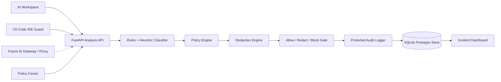
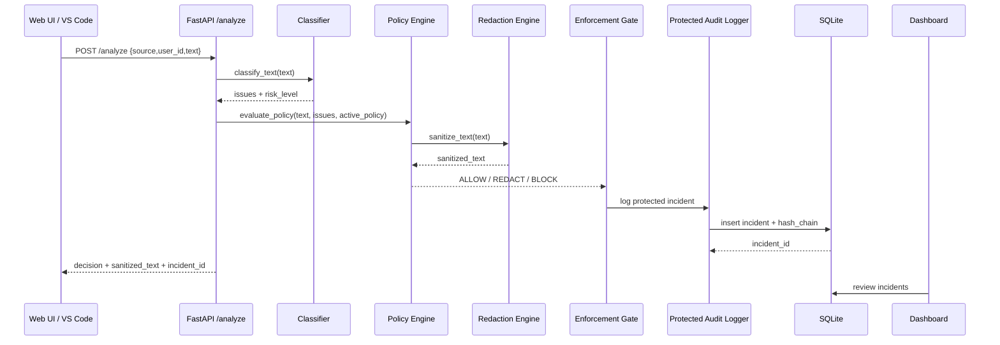

# SentinelGuard Architecture

SentinelGuard is a preflight AI data-loss-prevention layer for enterprise teams. It analyzes content before it is sent to an external AI service, applies a configurable policy, produces a sanitized payload when possible, and records an audit event for security review.

## Component View



## Runtime Pipeline

1. A user submits content from the AI Workspace or scans selected code from VS Code.
2. `POST /analyze` receives `{source, user_id, text}`.
3. The classifier detects sensitive patterns and assigns a risk level.
4. The policy engine checks the active policy configuration.
5. The redaction engine creates a sanitized version of the content.
6. The enforcement gate returns one of three decisions:
   - `ALLOW`: content can proceed.
   - `REDACT`: only sanitized content should proceed.
   - `BLOCK`: content is refused before external AI use.
7. The protected audit logger writes the decision, issues, sanitized preview, active policy snapshot, and hash-chain proof.
8. The dashboard displays incidents, remediation guidance, and audit proof.

## Backend API

### `POST /analyze`

Primary analysis endpoint used by both the web workspace and IDE extension.

Request:

```json
{
  "source": "AI_WORKSPACE",
  "user_id": "demo-user",
  "text": "Can you debug this? api_key=sk-demo..."
}
```

Response:

```json
{
  "risk_level": "HIGH",
  "issues": ["CREDENTIALS", "CREDENTIALS_KEY_VALUE"],
  "decision": "BLOCK",
  "sanitized_text": "Can you debug this? api_key=[REDACTED]",
  "incident_id": 12
}
```

### `GET /incidents`

Returns protected incident records with optional `source` and `risk_level` filters.

### `GET /incidents/{id}`

Returns a single incident for dashboard drill-down and IDE deep-linking.

### `GET /policy`

Returns the active demo policy configuration.

### `PUT /policy`

Updates the active policy controls for subsequent analysis requests.

### `GET /health`

Returns service health for the UI and VS Code status indicator.

## Detection Coverage

The classifier is rule-based for deterministic demo behavior. It covers:

- Credentials: API keys, passwords, bearer tokens, JWTs, private keys, cloud/vendor tokens, database URIs.
- PII: emails, phone numbers, SSNs, passports, driver's licenses, DOBs, addresses.
- Government IDs: Aadhaar, PAN, EIN.
- Financial data: payment cards with Luhn validation, routing numbers, bank accounts, IBAN, SWIFT/BIC, VAT, GSTIN.
- Health data: medical record, patient, prescription, and insurance identifiers.
- Legal/HR/business data: privileged legal markers, case IDs, employee IDs, compensation, confidential pricing, forecasts, contracts, proposals, and roadmaps.
- Entropy heuristics for suspicious unknown tokens.

## Policy Controls

The Policy Center controls how findings are handled:

- Block credentials and database connection strings.
- Redact high-entropy unknown secrets.
- Redact PII.
- Redact financial data.
- Redact government identifiers.
- Redact health identifiers.
- Redact legal markers.
- Redact HR and compensation data.
- Redact commerce/customer operations data.
- Redact confidential business content.
- Choose protected or full-text audit storage.

The default policy is conservative: credentials are blocked, sensitive categories are redacted, and audit storage uses protected sanitized previews.

## Protected Audit Storage

Sensitive incidents are not stored as raw original prompts by default. In `PROTECTED` audit mode:

- The incident record keeps sanitized previews for analyst review.
- The original field is replaced with a protected-storage marker plus sanitized content.
- The hash-chain proof is calculated over the stored audit payload.

`FULL_TEXT` mode exists only for controlled demonstrations where full original prompt review is needed.

## VS Code IDE Guard

The extension adds:

- Selection scanning.
- Full-file scanning with size protection.
- Backend health status.
- Diagnostics on risky scanned ranges.
- Rich scan reports.
- Copy, insert, and replace actions for sanitized content.
- Dashboard deep links to the incident record.

## Web Interface

### AI Workspace

The workspace demonstrates the user-facing enforcement path:

- Submit prompt.
- See classification, policy decision, issues, and sanitized output.
- Generate policy-safe prompt rewrites.
- Send only approved content through the simulated AI gateway.
- Blocked prompts cannot be sent.
- Live policy strip shows key active controls before analysis.

### Incident Command

The dashboard provides:

- Source and risk filters.
- Search by issue, user, decision, and source.
- Decision distribution metrics.
- Incident detail modal.
- Policy snapshot for the selected incident.
- Remediation guidance.
- Hash-chain proof.

### Policy Center

Security admins can tune policy controls and audit storage mode without changing code.

## Sequence Diagram



## Production Roadmap

The prototype is intentionally local-first. Production hardening would add:

- SSO/OIDC and role-based access control.
- Encrypted database storage and KMS-managed keys.
- PostgreSQL or managed relational storage.
- Immutable audit export to SIEM/SOAR.
- Transparent AI proxy/gateway mode.
- Policy versioning and approval workflows.
- Model-assisted contextual classification alongside deterministic rules.
